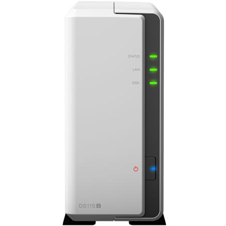

## DS115j

    群晖经典单盘位机型。

### 购入信息

2017年08月于京东购入一台。

### 折腾记录

- 使用过两年兼容机之后，入手了这个机器，将序列号替换到兼容机上，算是付费上车，强行洗白了之前的“黑群晖”。
- 功耗特别小，但是 CPU 很弱，日常体验很糟糕，仅仅能作为储存设备使用。
- 使用它独立运行了一个代理服务，为家里的开源仓库提供网络服务。
- 附：[DS115j 网络性能测试](./report/mini-server/ds115j.md)

### 适用场景

- 适合很清理的储存服务。
- 想洗白黑群晖的用户。

