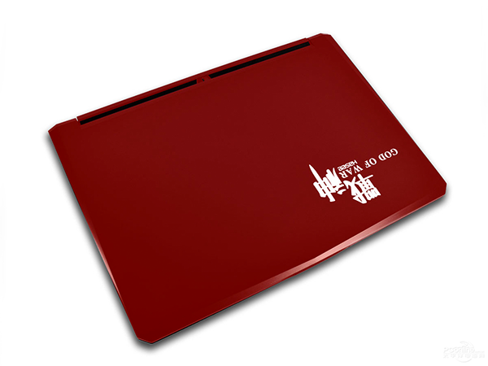

## 神州Z78172R2 

    HASEE Z78172R2



### 购入信息

2015年7月于京东购入一台。

### 折腾记录

- 买的时候加了一根Crucial8G内存，一块Crucial BX100 250G。
- 把拆下来的1T硬盘加了个储存巴士的壳当移动硬盘用了，非大型游戏或者虚拟机编译程序完全无声音。
- 加了一块```三星MZAPF032HCFV-000H1``` SSD，读取速度510M/s、最高写入速度：110M/S，刷了PE做临时交换分区使用，如果系统出问题，直接因为隐藏PE分区。98块入的，现在价格涨了一倍多。
- 因为开了8GB的RAM Disk，有的时候内存不足够使用，又加了两根英睿达Crucial内存，凑足32G，目前使用良好。（机器支持上限）
- 额外投入成本共计：98+398+928=1424

### 适用场景

- 虚拟机开一堆无压力；游戏各种无压力。

### 使用体验

- <del>必须使用外置散热器，不然跑起来风扇音量惊人</del>。
- 不玩超大的主机游戏，基本静音。
- Nvidia更新比较频繁，游戏优化比较多，鲜见应用优化。
- 使用Chicony适配器，150W功率比较大，不太好配，不过据说配180W的可以进一步提升性能。
- 高性能模式，功率满载100W左右；节能模式功率满载20W左右；平时娱乐模式功率30W左右，适合长期开机。