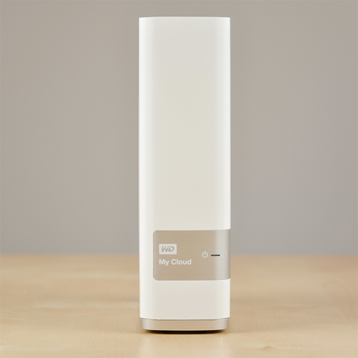

## WD MY CLOUD 3T

	WD MY CLOUD 3T

### 购入信息

2014年12月于淘宝购入一台。

### 折腾记录

先升级后降级，关闭TimeMachine/远程访问等，使用至今。

### 适用场景

- 一般家庭使用，比起备份，更偏『共享』，『快取』。
- 笔记本、平板、手机等可联网的设备一堆的环境。

### 使用槽点

- 官方系统设计存在问题，如果访问web，整机变慢，查看进程，发现起了一堆apache。
- 扫描文件比较频繁，休眠感觉不算多。