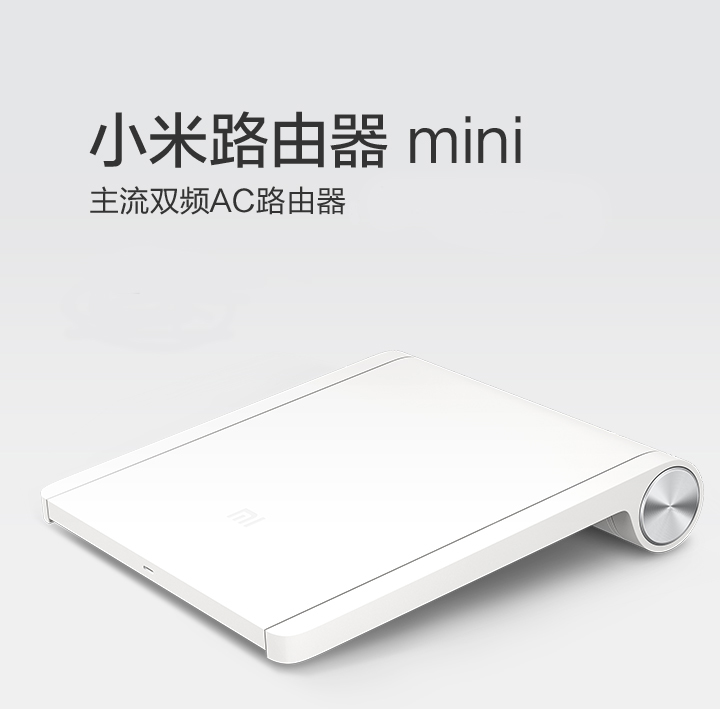

## 小米路由Mini

	XiaoMi Route Mini



### 购入信息

2015年02月于京东购入两台。

### 折腾记录

之前一直使用原始系统，直到某日小米更新系统之后，使用Nginx劫持404页面等行为，刷了```PandoraBox-ralink-mt7620-xiaomi-mini-squashfs-sysupgrade-r1024-20150608```，目前一台在为妹纸服务，一台在工位为我服务，状态良好。

### 适用场景

- 无线需求相对较多的场景。
- LAN不需要大于100M的场景：路由上级带宽100M；不使用局域网，或局域网不需要传输大文件；受限于设备IO的限制，无法大于100M。
