## 屏幕展示 - 受辐射历史记录

    记录一下屏幕的变化.

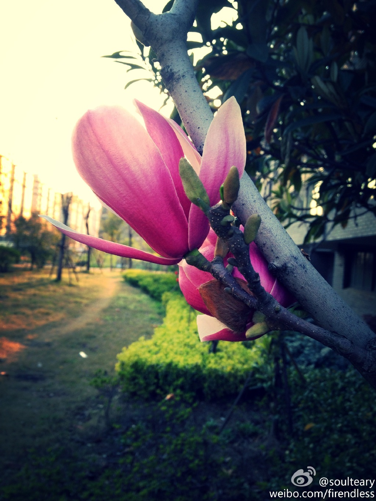

    [北京 - 理想国际大厦 - 新浪网](http://weibo.com/1220149481/A77C7caD1) / 屏幕多了,窗口切换就少了.

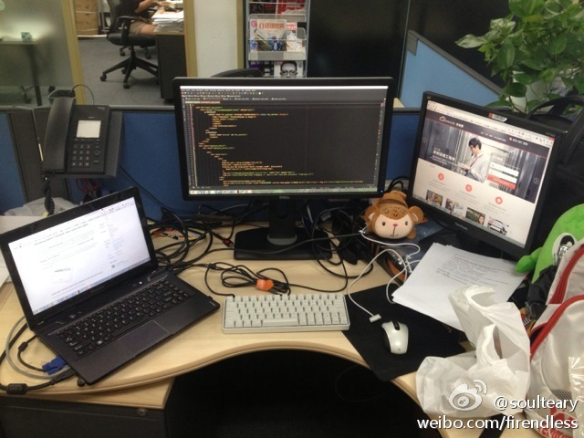

    [北京 - 海淀 - 临时的家](http://weibo.com/1220149481/AtQHR3c7x) / 小屏幕...

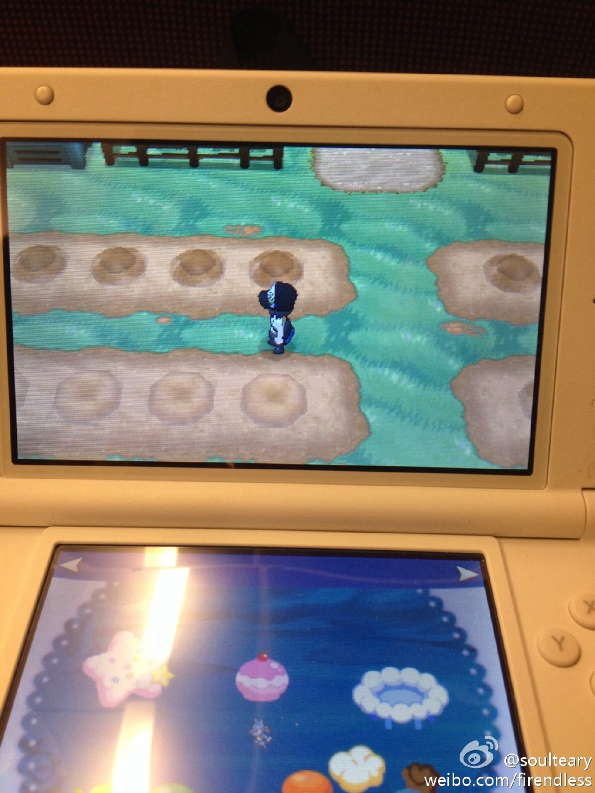

    [杭州 - 阿里巴巴西溪园区 - 淘宝网](http://weibo.com/1220149481/AzUoFgvXG) / 辗转到了剁手网后.

    [杭州 - 西溪北苑 - 临时的家](http://weibo.com/1220149481/B53AoaFT8) / 用另外一台笔电作为一台笔电的显示器.

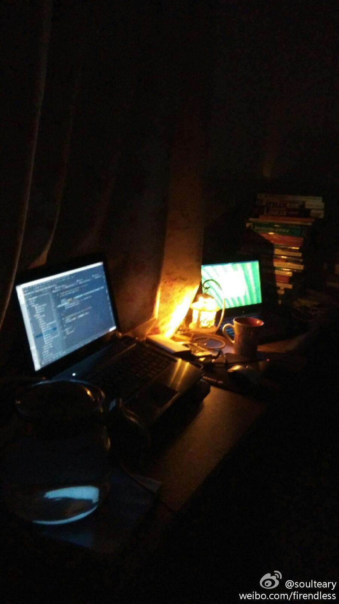

    [杭州 - 阿里巴巴西溪园区 - 淘宝网](http://weibo.com/1220149481/B7M6MzOMu) / 屏幕不知不觉多了.

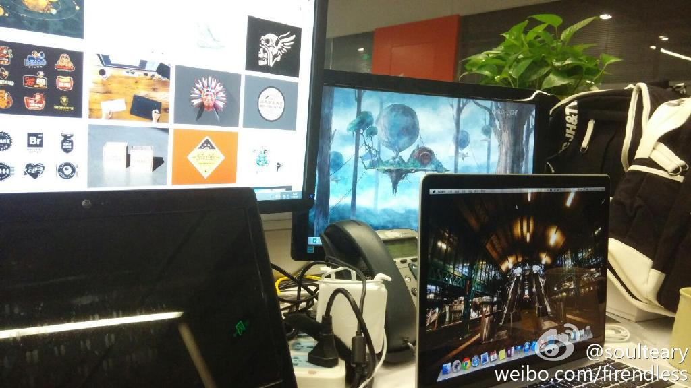

    [杭州 - 西溪北苑 - 临时的家](http://weibo.com/1220149481/B9aqBzmIb) / 桌面的线有点麻烦了.

    [杭州 - 西溪北苑 - 临时的家](http://weibo.com/1220149481/BnVq23imb) / 小屏幕...

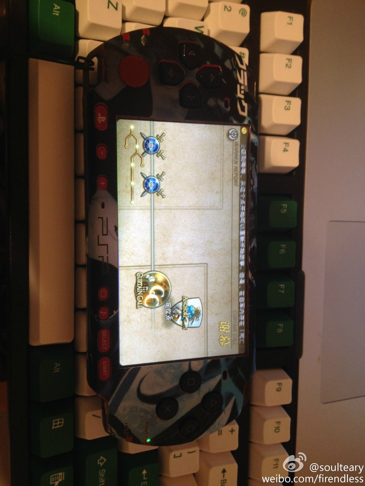

    [杭州 - 阿里巴巴西溪园区 - D2会场](http://weibo.com/1220149481/Bt37ertHZ) / 如果家里有这么一块屏幕就好了

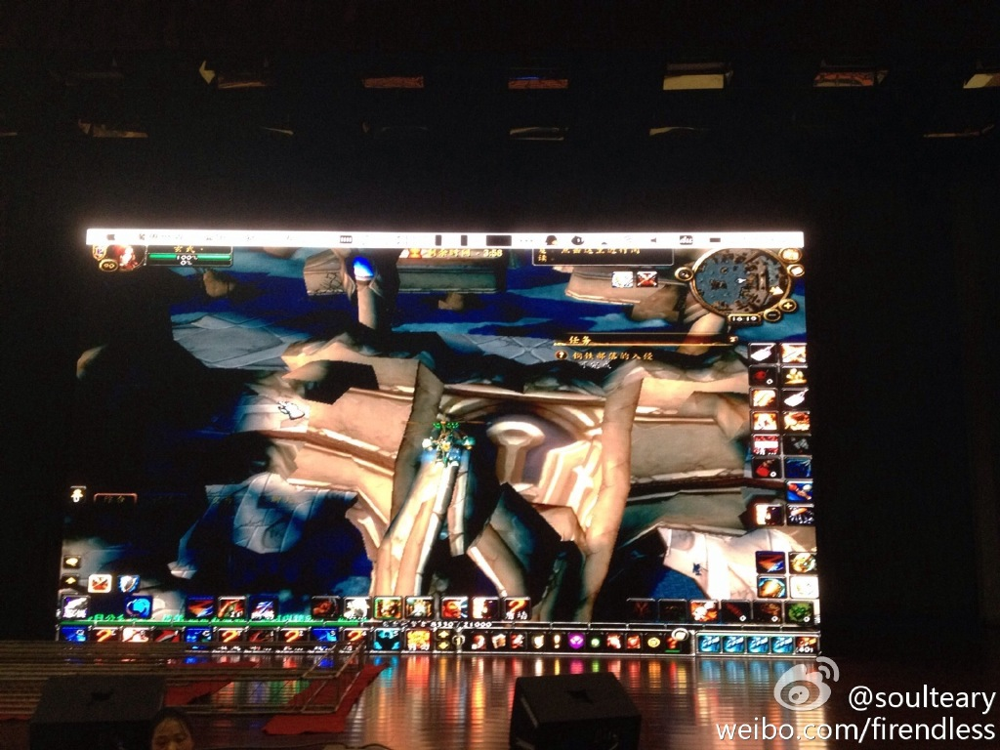

    [杭州 - 西溪北苑 - 临时的家](http://weibo.com/1220149481/Bw8942nDm) / 家里屏幕升级

    [杭州 - 阿里巴巴西溪园区 - 淘宝网](http://weibo.com/1220149481/BEsn98nFc) / 嗯,一块不大不小的屏幕

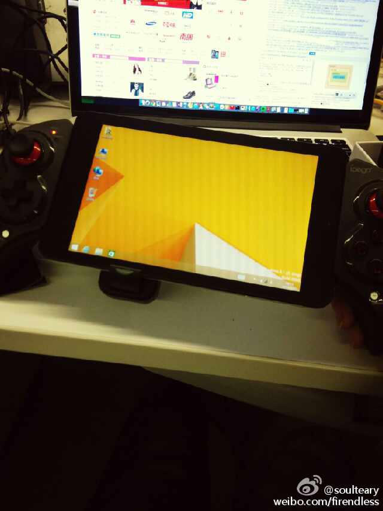

    [杭州 - 西溪北苑 - 临时的家](http://weibo.com/1220149481/C2ioDmEDl) / 用来打老版本win游戏不错

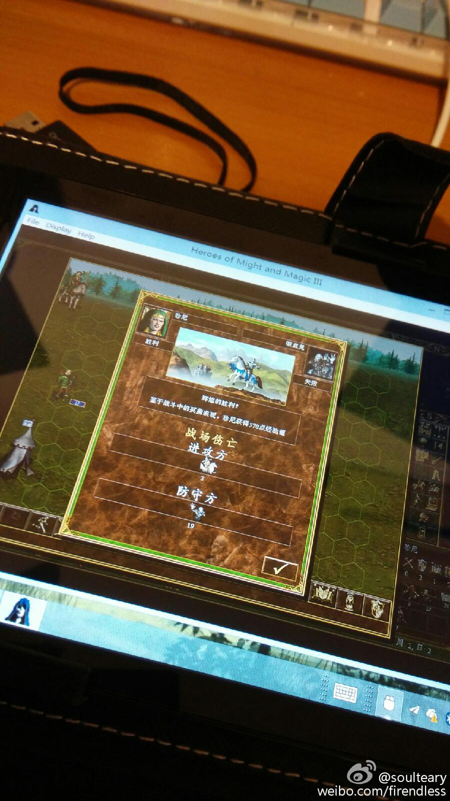

    [北京 - 望京国际研发园 - 美团网](http://weibo.com/1220149481/Chl3MgM7G) / 重新回到简简单单

    [北京 - 望京新城4区 - 临时的家](http://weibo.com/1220149481/CnK6o59Zj) / 7寸VGA,感觉比手机都小

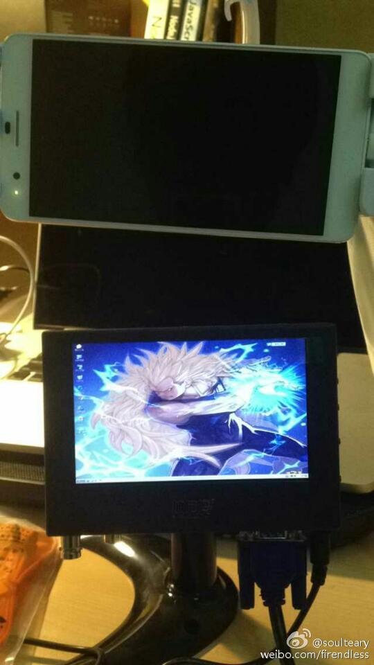

    [北京 - 望京国际研发园 - 美团网](http://weibo.com/1220149481/CplTAmjxS) / 移动开发调试必备

    [北京 - 望京新城4区 - 临时的家](http://weibo.com/1220149481/D03DtFCMc) / 9寸大的游戏机屏幕

    [北京 - 锐创国际中心 - 美团网](http://weibo.com/1220149481/DmA3EgL1J) / 混合开发可以试多屏

    [北京 - 望京炫彩嘉轩 - 临时的家](#) / 好多没上传相册,先占位,回头补

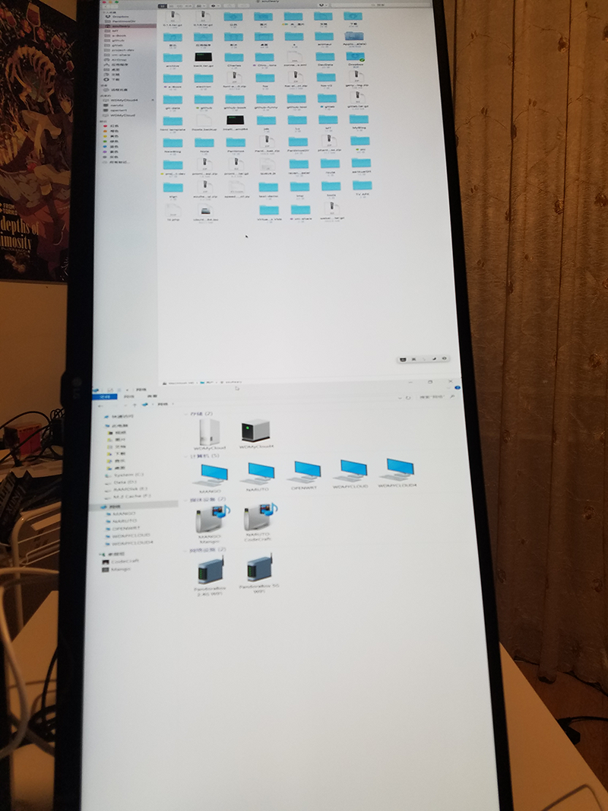

