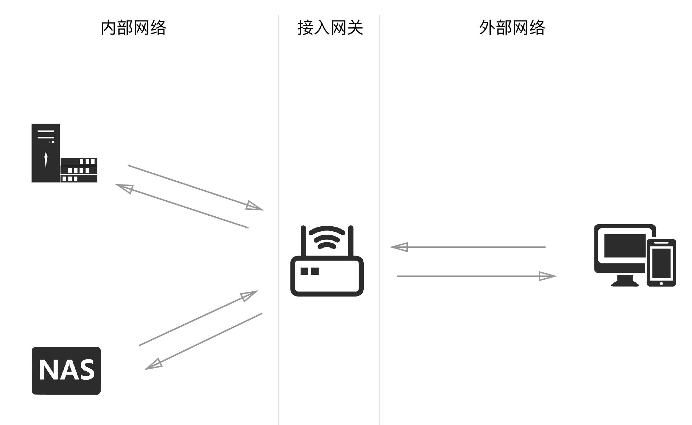

# 远程访问及数据交互

目前数据访问抽象图如下：

## 远程管理

远程管理目前主要有两个模式：

- 先通过加密隧道访问内部网关节点，然后再进行下一步操作。
- 先通过公网反向代理访问内部设备，然后再进行下一步操作。

差异点主要有两个：

- 是否使用 tcp 隧道，是否直接访问内部具体设备。

因为多数服务和应用都跑在 Linux 系统上，所以隧道提供的 SSH 方式已经能够满足 90% 以上的需求了。

但是因为使用 Mac 跑一些 OSX 应用，所以又开启了远程 VNC 访问的方式。不使用 TeamViewer 等工具的原因有下面几点：

- 额外支付的成本均摊到每次使用成本上有些高。
- 三方应用多次数据泄露，不太信任他们了。

加密隧道的搭建主要使用 DDNS 方式，这里我曾经购买过花生壳之类的服务，目前的方案是：

- 群晖的DDNS服务(主要使用)
- CloudFlare API 动态更新 DNS 记录

另外，因为群晖的硬件复杂度相对较低、系统也比较简单，可以使用容器配合定时任务，完成隧道的高可用。

## 数据交互

目前文件管理几乎全部使用了群晖的文件管理系统，少数不走群晖的文件保存在 Apple Cloud 中。代码一律保存在局域网的 GitLab 中。

以上内容全部具备版本控制。

因为上面的数据隧道已经比较完善、稳定，加上我所在的宽带区域的上行可以支持到 `20~40M` ，所以：

- 在外部网络环境，下载内部大文件，使用 HTTP ，走群晖管理界面或者地址即可。
- 在外部网络环境，想在内部下载大文件，使用群晖下载工具，下载到内网即可。
- 在外部网络环境，操作服务器上的文件，使用 SSH ，通过隧道和操作普通云主机一样。

## 相关博客文章

- [ 远程管理 Mac OSX 设备 ][1]
- [ Mac OSX 开机启动应用 (supervisor) ][2]
- [ 群晖系统上的 Docker 使用拾遗 ][3]
- [ 聊聊群晖的进程守护 ][4]

[1]:	https://soulteary.com/2019/03/11/mac-osx-remote-management.html
[2]:	https://soulteary.com/2019/03/11/mac-osx-starts-up-applications-supervisor.html
[3]:	https://soulteary.com/2018/08/15/docker-on-synology-gleaning.html
[4]:	https://soulteary.com/2018/06/13/synology-with-supervisor.html
