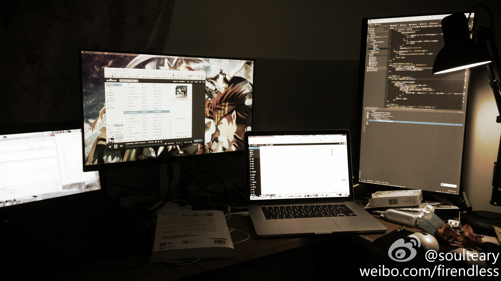

## Dell U2414H

    Dell U2414H

### 购入信息

2014年05月于淘宝购入两台。

### 折腾记录

- 杭州使用之后，就闲置回家了。

### 适用场景

- 小屏幕笔电/主机。
- 需要扩展屏幕需求的场景。
- 想要组双屏/三屏的场景。

### 个人体验

- 旋转支架比较赞，但是双屏使用的时候对齐比较麻烦，不如自购旋转支架。
- 接口单一，只是适合Mac或者有双DP/DVI的游戏主机、笔电。
- 『菊花』串联并没有想象中的完美。