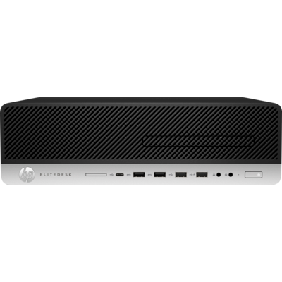

## HP EliteDesk G4 800

    HP EliteDesk G4 800

### 购入信息

2018年09月于淘宝购入一台。目前使用下来非常满意的一台机器 [配置详情](../notes/2018-hp-elitedesk-g4-800.md)，完美托管了所有的容器服务。

### 适用场景

- 需要本地低延迟访问各种服务的场景。
- 需要本地有一个静音、相对大的硬件资源池的场景。

### 个人体验

- 买就对了。
- 美中不足，产品线更新比较慢，始终没有用到最新版本的 Intel CPU。
