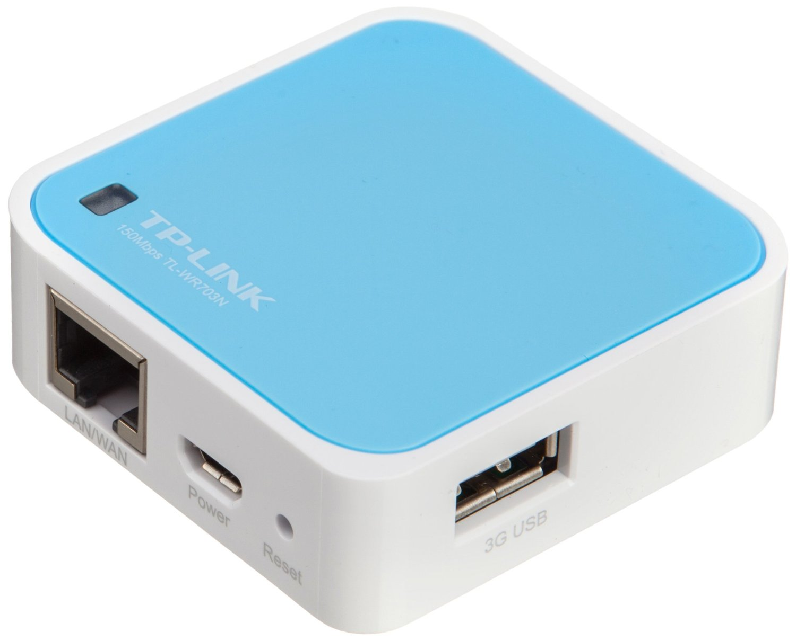

## TP-LINK TL-WR703N 150M无线迷你型3G路由器

    TP-LINK TL-WR703N

### 购入信息

2013年01月于亚马逊购入一台。

总感觉好像三个颜色都凑齐了（其他的忘记在哪里买的了），而且阿里某活动还送了一款定制款...

### 折腾记录

- 记得当时是需要在手机端测试新浪云的代码，好像AP也是隔离的，无法互相访问，于是入手。
- 始终没下定决心入焊枪自己加内存，也不愿意插U盘，刷带Luci的OpenWRT。
- 之后有一段时间顶替MR12U做了一阵3G路由器。

### 适用场景

- 临时调试，或者临时扩展网络可以用。不过现在都用手机热点了，不是么。
- 使用时间一长，散热会出问题，概率死机，或者稳定的丢包变慢。

