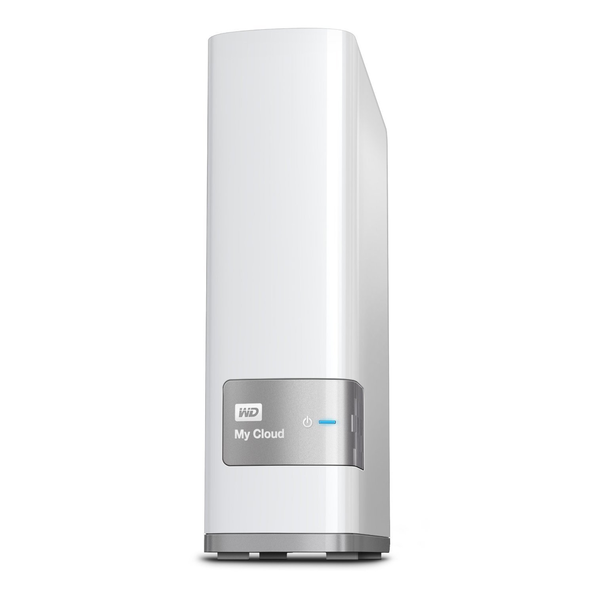

## WD MY CLOUD 4T

    WD MY CLOUD 4T

### 购入信息

2016年4月于亚马逊海外淘购入一台。

### 折腾记录

- 关闭所有除了储存外的功能，仅做备份机使用。

### 适用场景

- 一般家庭使用，比起备份，这个设备更偏向『多人共享』，『快速存取』两点。
- 笔记本、平板、手机等可联网的设备数量比较多，存在数据交换的环境。

### 使用体验

- 新版本的固件用起来蛮顺手的，不需要折腾。
- 新版本固件正常休眠。
- 海外淘的电源适配器比国产版的好。