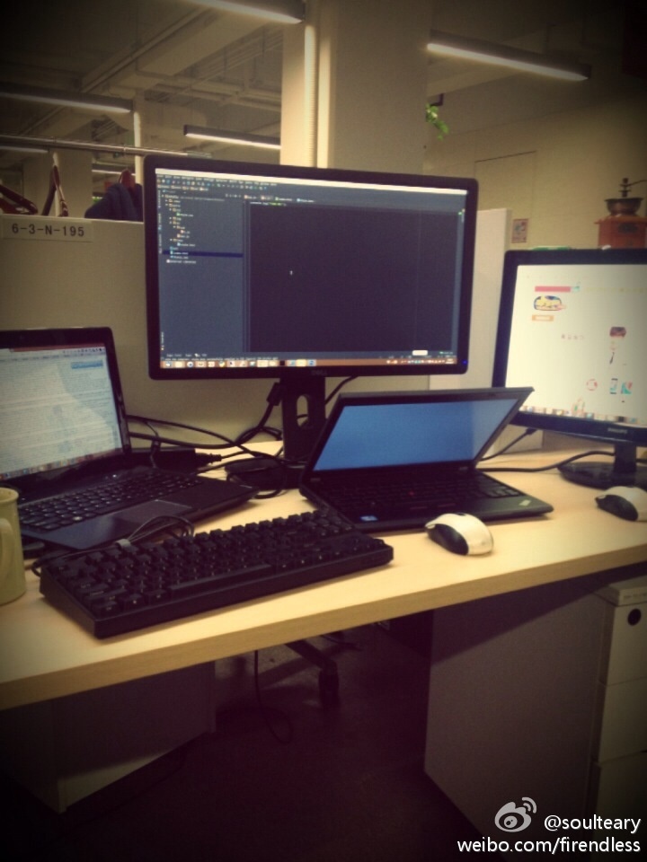
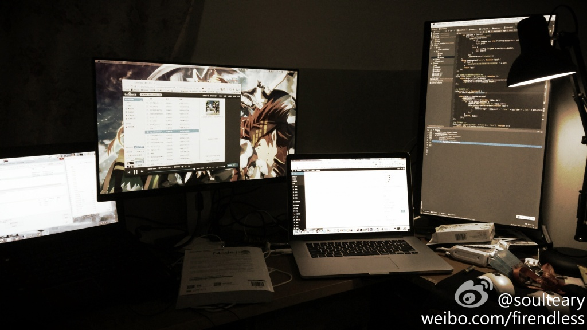
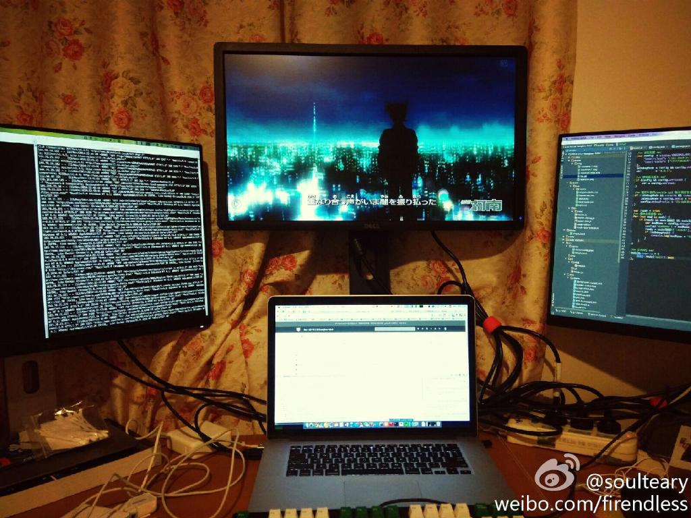
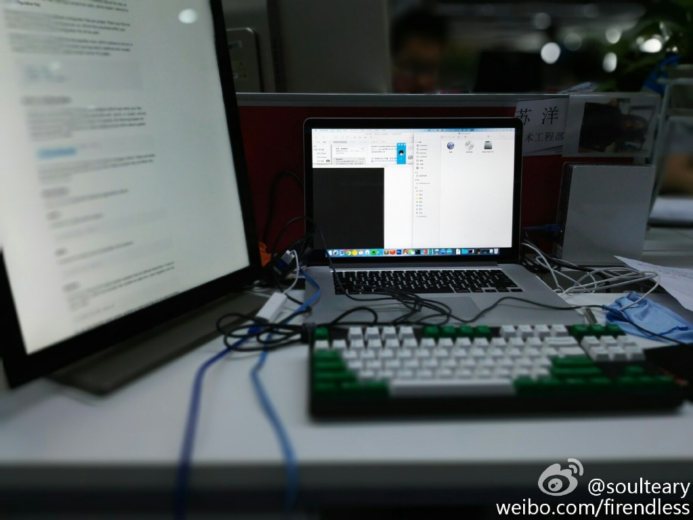
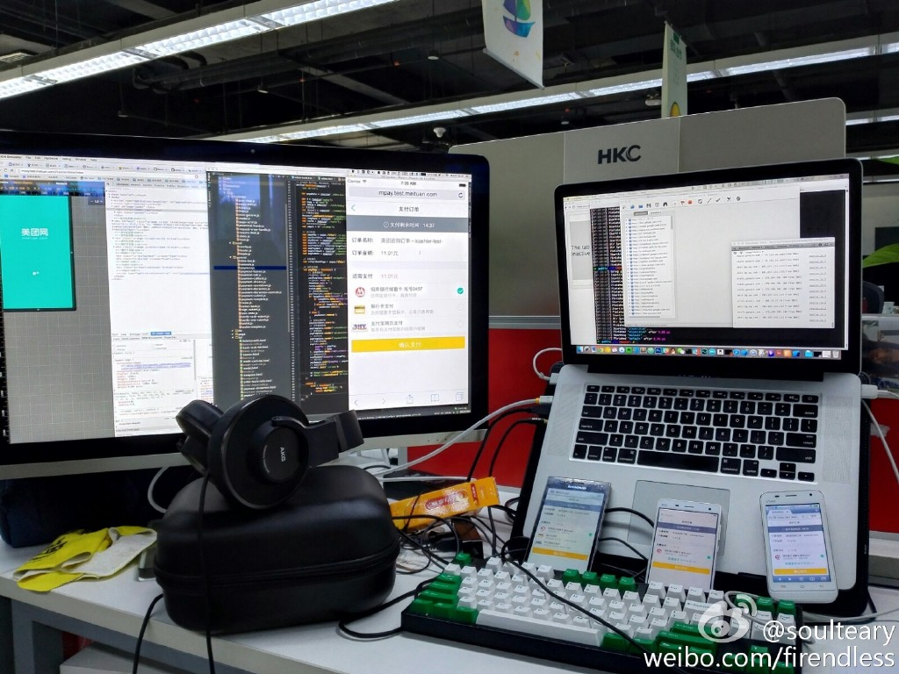
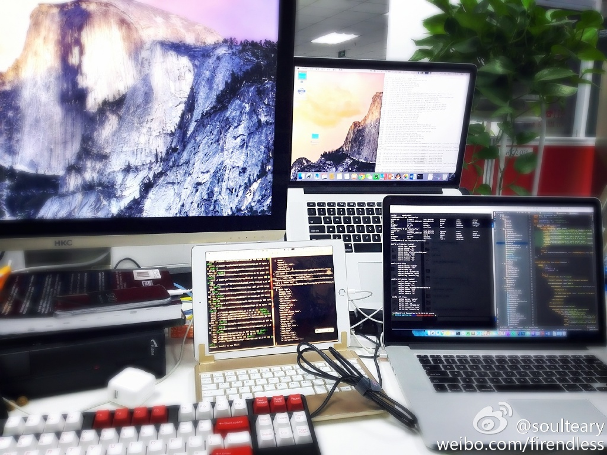
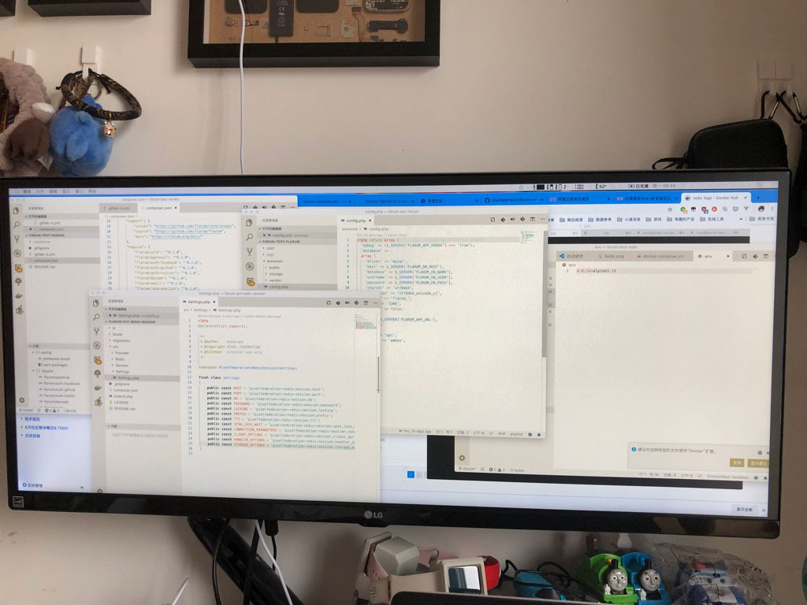
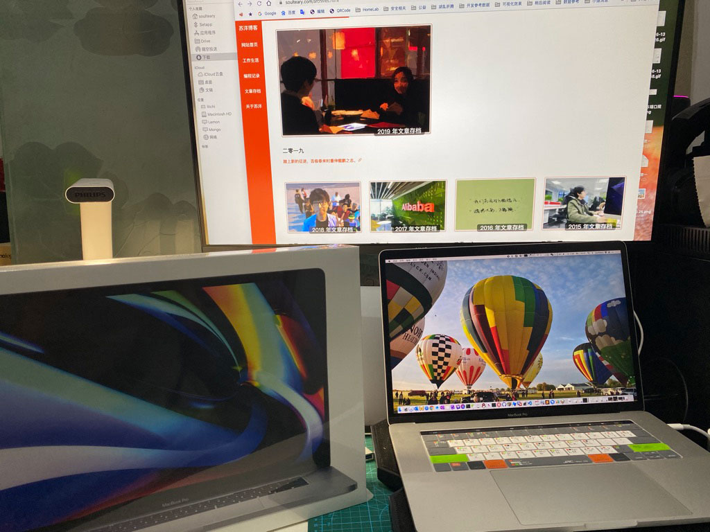
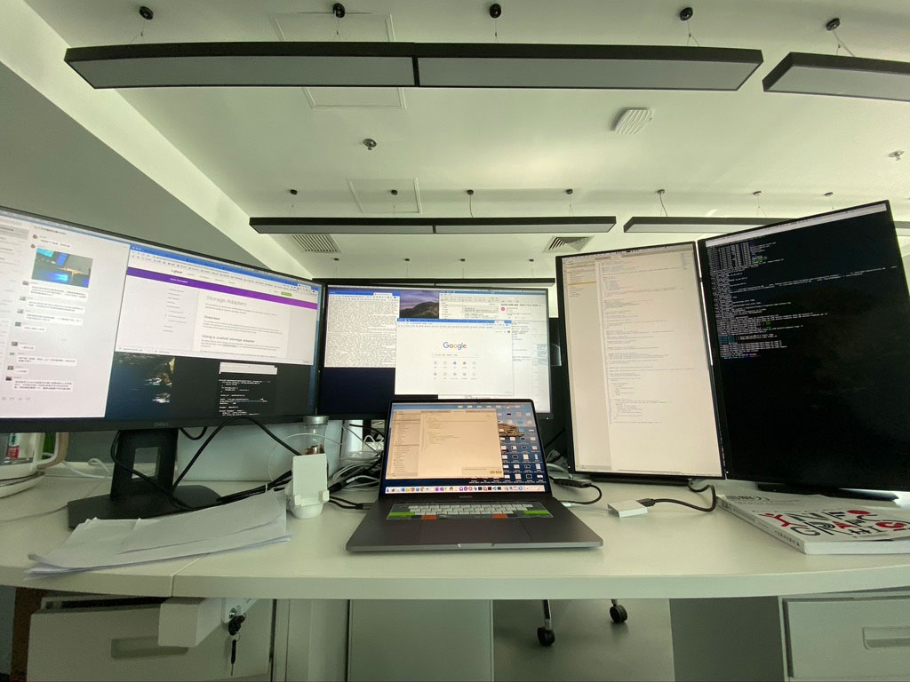

# 屏幕展示 - 受辐射历史记录

    记录一下屏幕的变化，时间范围 2012 ～ 2020。

---

    屏幕多了，窗口切换就少了。

📍[北京 - 理想国际大厦 - 新浪网](http://weibo.com/1220149481/A77C7caD1)

---

    小屏幕。

📍[北京 - 海淀 - 临时的家](http://weibo.com/1220149481/AtQHR3c7x)

---

    辗转到了剁手网后。

📍[杭州 - 阿里巴巴西溪园区 - 淘宝网](http://weibo.com/1220149481/AzUoFgvXG)

---

    用另外一台笔电作为一台笔电的显示器。

📍[杭州 - 西溪北苑 - 临时的家](http://weibo.com/1220149481/B53AoaFT8)

---

    屏幕不知不觉多了。

📍[杭州 - 阿里巴巴西溪园区 - 淘宝网](http://weibo.com/1220149481/B7M6MzOMu)

---

    桌面的线有点麻烦了。

📍[杭州 - 西溪北苑 - 临时的家](http://weibo.com/1220149481/B9aqBzmIb)

---

    小屏幕。

📍[杭州 - 西溪北苑 - 临时的家](http://weibo.com/1220149481/BnVq23imb)

---

    如果家里有这么一块屏幕就好了。

📍[杭州 - 阿里巴巴西溪园区 - D2会场](http://weibo.com/1220149481/Bt37ertHZ)

---

    家里屏幕升级。

📍[杭州 - 西溪北苑 - 临时的家](http://weibo.com/1220149481/Bw8942nDm)

---

    嗯，一块不大不小的屏幕。

📍[杭州 - 阿里巴巴西溪园区 - 淘宝网](http://weibo.com/1220149481/BEsn98nFc)

---

    用来打老版本win游戏不错。

📍[杭州 - 西溪北苑 - 临时的家](http://weibo.com/1220149481/C2ioDmEDl)

---

    重新回到简简单单。

📍[北京 - 望京国际研发园 - 美团网](http://weibo.com/1220149481/Chl3MgM7G)

---

    7寸VGA，感觉比手机都小巧。

📍[北京 - 望京新城4区 - 临时的家](http://weibo.com/1220149481/CnK6o59Zj)

---

    移动开发调试必备。

📍[北京 - 望京国际研发园 - 美团网](http://weibo.com/1220149481/CplTAmjxS)

---

    9寸大的游戏机屏幕。

📍[北京 - 望京新城4区 - 临时的家](http://weibo.com/1220149481/D03DtFCMc)

---

    混合开发可以试多屏。

📍[北京 - 锐创国际中心 - 美团网](http://weibo.com/1220149481/DmA3EgL1J)

---

    好多没上传相册，先占位，回头补。

📍[北京 - 望京炫彩嘉轩 - 临时的家](#)

---

    搬家过程中不小心把显示器碰坏了，临时买了一台先顶着用。

📍[北京 - 海淀天作国际 - 临时的家](#)

---

    20年初返京，公司也刚搬家，人都没到，那么就四台一起用吧。

📍[北京 - 海淀量子芯座](#)

---
