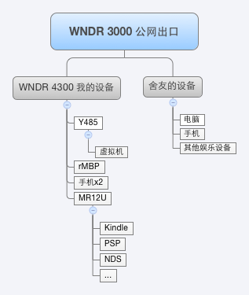

## 基础网络使用

> 当前使用网络结构示意图

### 使用多路由原因

- 整体稳定性考虑，一级路由作为内网<=>公网流量交换设备，关闭Wi-Fi功能，设置网络连通性自检脚本／重拨脚本／重启脚本。
- 整体灵活性考虑，利于更换宽带服务商，或者修改宽带接入方式，存在继续更换宽带服务商的可能性（2年内折腾过两次），使用单独设备进行拨号管理，可以避免因为更换路由配置而影响到整体网络的状况。
- 安全隔离方面考虑，从路由用于三方智能插座接入网络，避免潜在的漏洞利用影响整体网络安全。
- 安全隔离方面考虑，临时网络扩展，个别临时无线设备会使用从路由网络，避免潜在的安全风险。（特别的设备不支持AES+WPAK2加密方式）

### 二级路由下外接交换机的原因

- 性能和扩展性的考虑，路由主要负责AP+内网设备的DHCP，交换机一方面负责扩展有线端口，另外一方面可以让设备直接交换数据，避免路由器耗费资源进行数据交换。

### 网络地址分配

- 避免任何`192.168.x.y`地址的使用。
- 一级路由／从路由／二级路由使用不同的网段，仅允许从子节点访问父节点。
- 二级路由使用DHCP服务，并进行静态地址绑定。
- 从路由不进行地址绑定，但是对从路由进行流速限制，避免潜在风险出现时的影响。

### 简单的网络安全配置

- 光猫关闭Wi-Fi功能，设置禁PING等，LAN口仅外接一级路由。
- 一级路由使用三方固件，关闭Wi-Fi，LAN口仅外界二级路由和从路由，限制从路由公网速度。
- 二级路由使用三方固件，进行设备MAC地址绑定，Wi-Fi使用10位以上密码和AES-WPAK2加密方式。
- 从路由使用第三方固件，定期更换Wi-Fi接入密码，不使用时断电处理。

