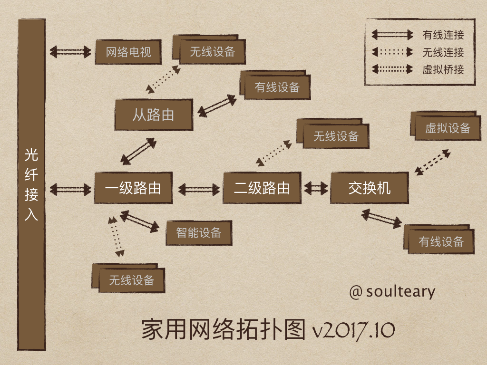

🚧 **Under Construction** 🚧

简单更新持续集成部分。

## 项目说明

    记录搭建家用兼顾学习和娱乐网络环境的一些事情，以及折腾过的一些硬件的小经验。

## 主要需求

| 功能 |备份数据|数据交换|无线接入|数据同步|workflow|开发学习|游戏娱乐|
| --- | --- | --- | --- | --- | --- | --- | --- |
| **核心** | 安全 | 高速 | 安全 | 无感知 | 易定制 | 流畅 | 流畅 |
| **重要** | 高效 | 易用 | 简单 | 准确| 省心 | 省心 | 舒适 |
| **可选** | 易用 | 安全 | 快速 | 全平台 | - | 冗余保障 | - |
| **观点** | [数据备份的几个可执行观点](./data-backup.md) | [高速数据交换](./high-speed-data-exchange.md)、[远程访问及数据交换](remote.md) | [安全的网络接入](./secure-network-access.md) | [免维护的数据同步](./data-exchange.md) | - | [持续集成](./cicd.md)、[如何使用 GitLab](./notes/gitlab-usage.md)、[虚拟化和容器](./notes/docker-and-vmware.md) | [玩游戏的一些观点](./enjoy-game.md) |

### 额外需求

- 方案或者配置需要尽可能简化，半年、一年以上后如果需要调整，可以轻松升级、维护、修理设备。
- 网络中存在20台以上设备在线时，网络依旧需要通畅。

### 具体场景

- [1] 两个人的手机、平板、电脑 能够自动同步、备份照片等数据。
- [2] 电脑数据每日自动备份，自己玩的代码进行特殊备份。
- [3] 在线视频、在线游戏、实验性质的数据抓取可以在稳定的网络下进行。
- [4] 支持由于平时懒各种设备不断电，以及两个人都回家后10～20台设备在线时，网络通畅。
- [5] 设备处于相对安全的网络环境中。
- [6] 支持简单易用的workflow。

## 历史设备列表

    如果你考虑入手一些设备(主机/路由/网卡/显示器/储存/移动设备/娱乐/...)，或许可以从这里得到一些参考信息。
    也可以翻到文档底部，看看哪些设备（断电设备）不值得购买。

[待补全的设备清单](./device-list-history.md) | [显示器相关](./display-history.md)

## 当前屋内常保持联网设备清单及方案

- [家用10～20台在线设备可参考网络方案](./network.md)
- [无线网络的方案及性能数据](./wifi.md)
- [有线网络的方案及性能数据](./lan.md)

### 🌈 宽带资源

> 不敢想假如家里没有稳定的网络会怎样

| 资源类型 | 明细 | 备注 |
| --- | --- | --- |
| 北京联通 | 100M（小区限制） / 500M | 上下行可跑满 / 下行跑满，上行实际20M |
| 北京移动 | 5G | 放单位，团队宽带补充使用，下行 30MB/s，上行不定 |
| 北京联通 | 4G | 家用备份网络，用于家用监控等设备 |

- [1] 建议简化不必要的多线宽带，避免策略路由带来的各种问题，以及避免使用使用软路由聚合不同类型宽带，带来后续维护上的麻烦。
- [2] 带宽不依赖任何提速软件，避免额外的使用成本，避免当软件不可用时，带宽质量严重受损。

### ⭐️ 路由网关

> 影响网络质量的核心设备，负责部分网络安全事务

| 资源类型 | 明细 | 网络 | 储存 | 开始服务 |
| --- | --- | --- | --- | --- |
| 交换机 | NETGEAR GS116E ^1 | 千兆LAN x16 | - | 2017 |
| 路由器 | Newifi D2 ^2 | 2G WIFI / 5G WIFI / 千兆LAN | 8G | 2018 |
| 路由器 | Newifi D2 ^3 | 2G WIFI / 5G WIFI / 千兆LAN | 8G | 2018 |
| 路由器 | Xiaomi Mini 第一版 ^4 | 2G WIFI / 5G WIFI / 百兆LAN | - | 2015 / 2016 |
| 路由器 | Xiaomi Mini 青春版 ^5 | 2G WIFI / 百兆LAN | - | 2016 |
| 路由器 | 施耐德旅行插座 ^6 | 2G WIFI / 百兆LAN | - | 2018 |

- [1] 八口千兆交换机，带管理界面，自带铁壳散热，目前感觉最超值的一个设备。
- [2] 趁着现在这个特殊时间点入手，对之前路由做一个升级，铁壳散热更好、并且机器内存更大。
- [3] 依旧是使用主路由 & 拨号路由的方式进行家庭网络组网。
- [4] 硬伤是全部百兆LAN口，不适合200M+宽带入户的情况。刷机之后十分稳定，家用设备多可做主路由来拨号使用，家用设备少，不存在什么问题，已入三台，偶尔开启，作为开发调试路由使用。
- [5] 功耗极低，小巧方便，适合旅游或者临时需要网络进行调试的场景，三方适配的固件功能强大，已入三台，如果公司不限制使用自建路由作为调试环境，强烈建议入一台。
- [6] 插座自带一个简易的热点 WiFi 功能，如果你需要插上设备就自动组网，可以使用上面的设备，如果你没有自动组网等需求，那么这个能让你上网的插座，用起来体验还不错，唯一槽点，插座发热比较严重。

### 💻 主机资源

> 提供运算能力的设备

| 资源类型 | 明细 | 网络 | 储存 | 开始服务 |
| --- | --- | --- | --- | --- |
| 编码机器 | MacBook Pro ^1 | 千兆LAN & 5G WIFI | 32GBRAM / 2T  | 2019 |
| 公司机器 | MacBook Pro ^2 | 千兆LAN / 5G WIFI | 8GBRAM / 250GB  | 2019 |
| 资源机器 | HP EliteDesk G4 800 x1 ^3 | 千兆LAN & 5G WIFI | 64GBRAM / mixed | 2018 |
| 资源机器 | HP Gen8 MicroServer x1 ^4 | 千兆LAN | 4GBRAM / mixed | 2019 |

- [1] 2019 16-inch, i9 2.4GHz 终于等到的键盘改良款，开心。
- [2] 2019 13-inch, i5 2.4GHz 安装 Windows 闲置。
- [3] 目前使用下来最满意的机器 [配置详情](./notes/2018-hp-elitedesk-g4-800.md)，完美托管了所有的容器服务。
- [4] 最新购置了一台DIY后的“硬盘盒”，晚些聊聊这台设备。[配置详情](./notes/2019-gen8-custom-made.md)

### 🚚 储存资源

> 用来持久化保存资料（开始服务从作为存储角色开始计算）

| 资源类型 | 明细 | 网络 | 储存 | 开始服务 |
| --- | --- | --- | --- | --- |
| 资源备份 | Synology DS 718+ ^1 | 千兆LAN | 4T HDD / 3T HDD | 2017 |
| 主力备份 | HP Gen8 MicroServer x1 ^2 | 千兆LAN | 16TB (32TB Raid1) | 2019 |
| 资源机器 | HP EliteDesk G4 800 ^3 | 千兆LAN | 2T SSD | 2018 |
| 资源冷备 | 硬盘x4 ^4 | - | 1T HDD / 2T | 2016 / 2018 |
| 长期备份 | Canon G3800 ^5 | 2G WIFI | -      | 2019 |
| 清理备份 | Deli 9920 碎纸机 ^6 | - | -      | 2017 |
| 电力保障 | APC BR550G ^7 | - | - | 2017/2019 |

- [1] DS718+ 服役快两年了，运行十分稳定，后续储存空间完全不足的时候，考虑换一个四盘位的使用，附：[DS718+ 网络性能测试](./report/mini-server/ds718.md)。
- [2] 定制了一台网络储存器，使用 Raid 1 进行全盘备份，保存各种资料。
- [3] 用于备份、试验程序代码。
- [4] 每个季度使用资源冷备的盘进行一次全量的重新备份，避免增量备份出现问题，恢复时间过长或者不能完整恢复。
- [5] 打印不失为一种相对稳定的持久化保存方案，之前一台坏掉，又买了一台，真的好用，而且价格便宜。
- [6] 干掉持久化的纸质存储，最靠谱的莫过于加密级别的粉碎了，尤其是相对隐私敏感的内容。
- [7] 在所有电源都带稳流稳压作用后，添加一台UPS防止市电闪断带来的数据损坏或者写输出脏掉的问题。在使用了两年后，更换了一块电池，继续战斗。

### 📱 移动设备 & 🎮 游戏设备

> 强依赖无线进行交互的设备

| 资源类型 | 明细 | 网络 | 储存 | 开始服务 |
| --- | --- | --- | --- | --- |
| 游戏机 | PS4 | 2G WIFI | 500G HDD | 2017 |
| 游戏机 | PS4 Pro | 2G WIFI | 500G SSD | 2017 |
| 游戏机 | Switch | 2G WIFI | 忽略 | 2017 |
| 爪机 | iPhone 11 Pro | 4G / 5G WIFI | 512G  | 2019 |
| 爪机 | Redmi K20 Pro | 4G / 5G WIFI | 128G  | 2019 |
| 爪机 | iPhone SE | 4G / 5G WIFI | 64G  | 2017 |
| 爪机 | iP3GS ^1 | 2G / 2G WIFI | 忽略 | 2017 |
| 游戏机 | PSVx2 ^2 | 2G WIFI | 16G / 64G | 2015 / 2016 |
| 游戏机 | 3DSx2 ^3 | 2G WIFI | 64G / 64G | 2014 / 2016 |
| 平板 | iPad Air2 | 4G / 5G WIFI | 128G (改) | 2015 |
| 平板 | iPad Pro 12' ^4 | 5G WIFI | 256G | 2018 |

- [1] 年度最值手机，作为monitor使用，极低功耗，可以愉快跑脚本，已购两台。
- [2] 一正一破，好处是可以联机的游戏，可以大号带小号玩，另外可以做PS4手柄，玩不需要L2R2键的游戏还可以。
- [3] 游戏性比SONY强，联机赛高！
- [4] 体验真的棒，新系统后，可以作为苹果副屏幕。

### 🔮 智能设备

> 当下的所谓智能不过是可编程或者扩展了原有的使用者能力

| 资源类型 | 明细 | 网络 |备注 |
| --- | --- | --- | --- |
| 网络音箱  | 小米音箱 Pro ^1 | 2G WIFI | 2019年  |
| 空气净化器  | 小米净化器 Pro ^2 | 2G WIFI | 2019年  |
| 智能台灯  | 飞利浦台灯 ^3 | 2G WIFI | 2017年  |
| 网络插座  | 小米 xN ^4 | 2G WIFI | 2017年  |
| 网络网关  | 小米 x2 ^5 | 2G WIFI | 2017年  |
| 传感装置  | 小米 xN ^6 | 2G WIFI/ZigBee | 2017年  |
| 网络摄像头 | 水滴 x3 ^7 | 2G WIFI | 2015年、2016年、2017年、2018年 |
| 网络摄像头 | 小方等 x2 ^8 | 2G WIFI | 2018年 |

- [1] 音质还行，而且支持绑定QQ音乐，考虑入两台组全屋播放。
- [2] “手动档”挺好使，其他自动档位比较“弱鸡”，正常运行基本静音，总体点赞。
- [3] 用了一年多后偶然发现居然可以使用“米家”管理，支持联动音箱进行语音控制。
- [4] 小米开放局域网协议之后，把控客都换成了小米，支持编程这件事太好了。
- [5] 小米网关+空调插座，对于空间利用率很高，而且支持ZigBee/WiFi，还能网络调试。
- [6] 门磁可以避免出门老想着有没有关好门的问题，烟雾等传感器避免检查厨房，很省心。
- [7] 2015年从小米换到360就一直使用，目前使用还好，小问题是启动音有点惊悚，4台设备经常会有一台显示离线，我所在的小区，想稳定使用需要额外提供移动热点，目前考虑替换掉。
- [8] 小方支持自定义固件，折腾通过，计划对接群晖后替换所有360摄像头。
- 控客的插座APP不是很好用，尤其是不给SDK，无法定制开发，国内版本也不支持简单DIY（需要拆+编程器），故弃用。

### 💣 历史设备

> 断电的设备

[设备列表及原因](./past.md)

## 其他记录

- [博客中的折腾笔记](https://soulteary.com/subject/life/)
- [2016年上半年 自组x86软路由/迷你服务器的一些考虑](./notes/2016-think-about-x86-route.md)
- [2016年组建家用迷你服务器](./notes/2016-build-mini-home-server.md)
- [日志收集和查看](log.md) ^1
- [1] 待更新。
