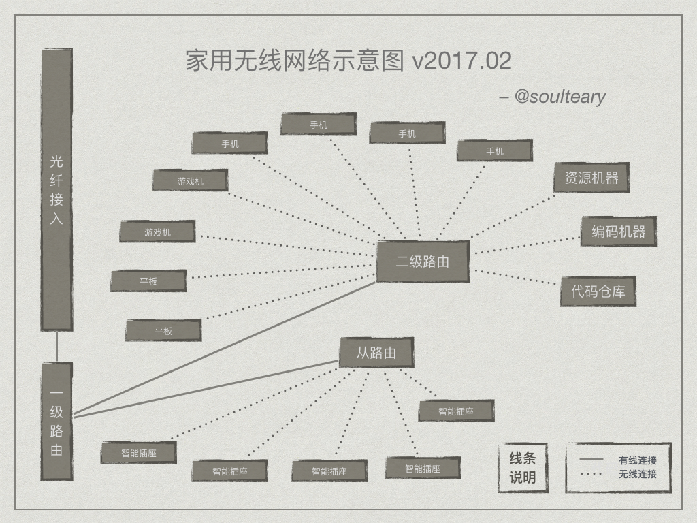

## 无线使用

计划中的无线使用图如下：

### WNDR3000

- [ ] 主路由作为共享路由使用，计划增加绑定Mac功能，减少额外风险。

### WNDR4300

- [x] 提供2G和5G网络并锁定频率为40MHZ，加密方式为AES+WPAK2。
	- [x] 测试5G手机速率
			- Mi3下载上传：63.63Mbps/4.12Mbps
	- [x] 测试2G手机速率
			- 4S下载上传：36.41Mbps/4.41Mbps
	- [x] 测试5G笔记本下载速度，20MB/s+
- [ ] 使用MR12U扩展临时网络，并对Mac列表中不支持AES+WPAK2设备支持访问。 
	- [ ] 测试无加密的使用是否流畅
- [x] NAS速度测试
	- 无线读写14~20M/s+